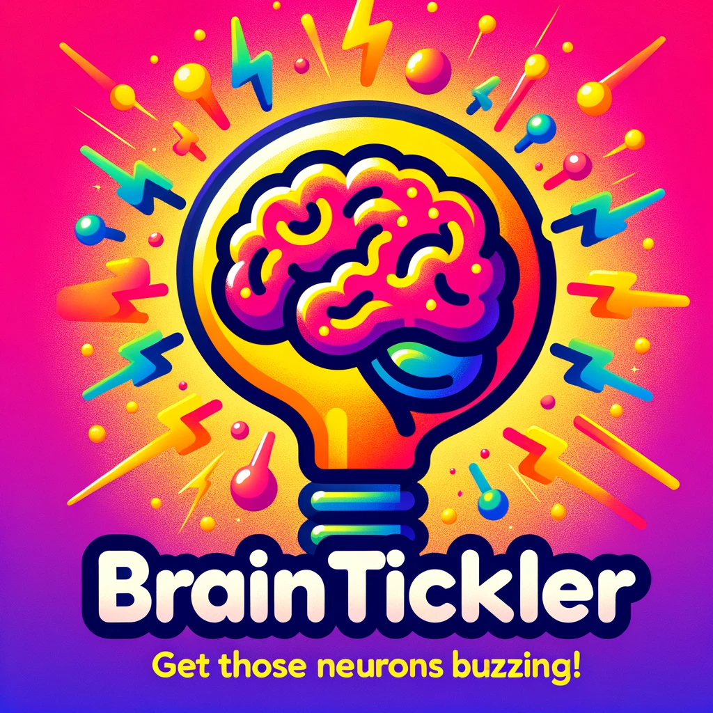

# BrainTickler 🚀

## React-Powered Quiz App

Jump into BrainTickler, your go-to quiz app built with React. Get those neurons buzzing!

Originated from Scrimba's Front-end career path.

## Skills & Learnings

- 🚀 **React Basics**: Mastered JSX, components, props, and state.
- 💡 **State Management**: Leveled up with React hooks.
- 👨‍💻 **UI Magic**: Nailed React event handling and forms.
- ⚡ **Optimized Performance**: Used `useMemo` and `useEffect` like a pro.
- 🔒 **Security**: XSS-proofed with DOMPurify.
- 🎲 **Algorithm**: Shuffled arrays with Fisher-Yates.

## Features

- 🎲 Dynamic questions via Open Trivia DB.
- ✅ Interactive multiple-choice format.
- 🎉 Instant feedback. Celebrate or sulk!
- 📱 Fully mobile-responsive.

## Tech Stack

- Front-end: React.js
- Hooks for State Management
- API: Open Trivia DB
